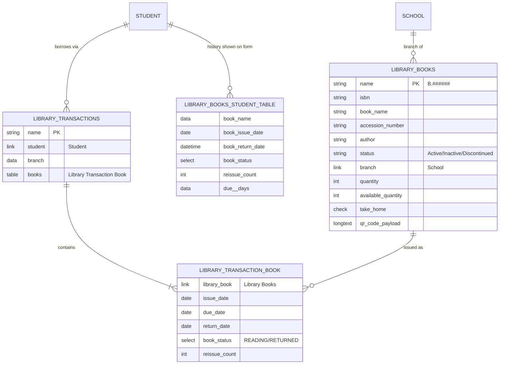
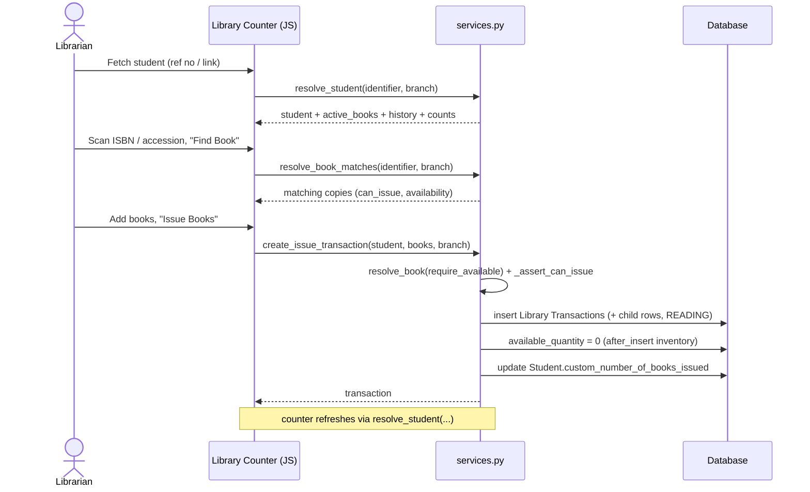
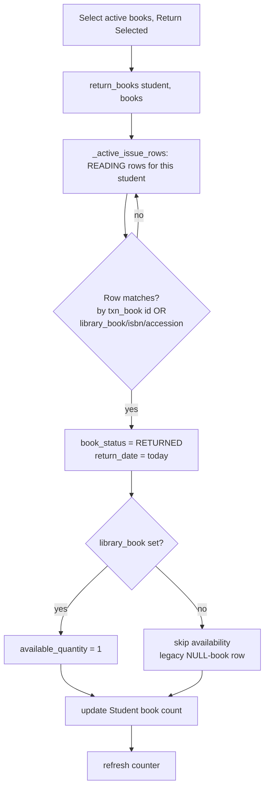
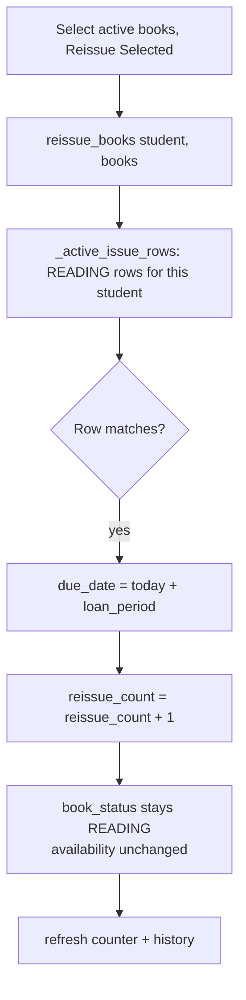
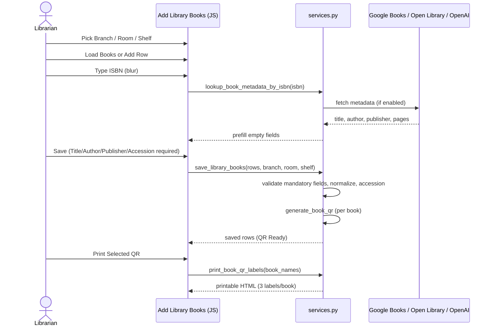
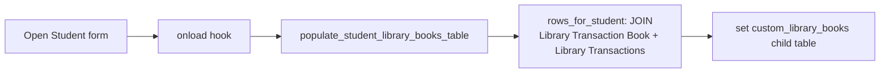
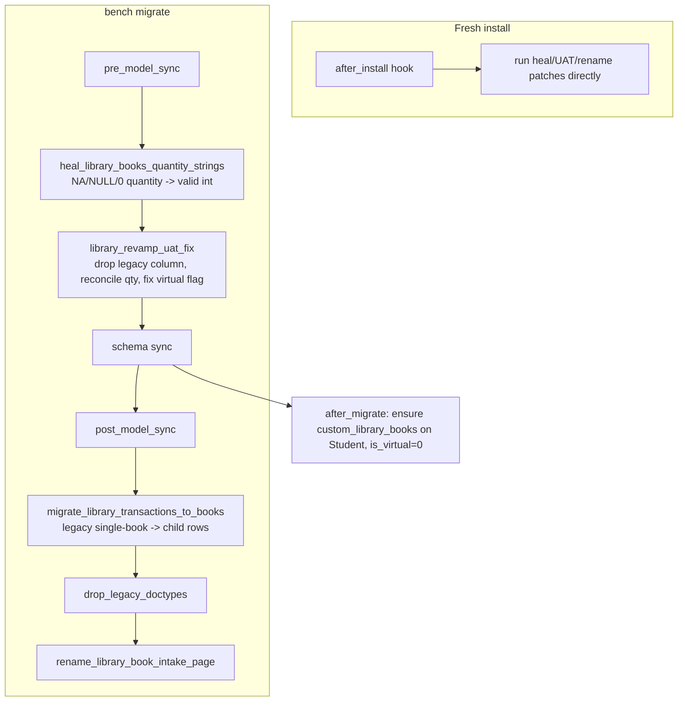

# Flows & Diagrams

This page collects the end-to-end flows of the Library Management app as
[Mermaid](https://mermaid.js.org/) diagrams (they render natively on GitHub) plus short step
lists. It is useful for both readers who want the big picture and developers who want to trace the
code.

- [Data model (ER diagram)](#data-model)
- [Issue books](#issue-books)
- [Return books](#return-books)
- [Reissue / renew books](#reissue--renew-books)
- [Book intake + QR labels](#book-intake--qr-labels)
- [Student borrowing history](#student-borrowing-history)
- [Install / upgrade migration](#install--upgrade-migration)

---

## Data model

> `Library Management Settings` is a Single doctype (global config) and is not part of the relations.

---

## Issue books

A librarian issues one or more copies to a student from the **Library Counter**.

**Rules enforced** (`_assert_can_issue` in `services.py`): book `status == "Active"`,
`take_home == 1`, branch matches the counter branch (unless the user has the **Branch Override
Role**), and `available_quantity > 0`.

---

## Return books

The matching scan is **scoped to the student in SQL** so it is correct and bounded (no global
row cap). Matching by the transaction-book **row id** lets the counter return legacy rows that have
no linked `Library Books` record.

---

## Reissue / renew books

Same selection + scan as Return, but the book **stays issued** — only the due date moves.

`loan_period` comes from **Library Management Settings** (default 30 days).

---

## Book intake + QR labels

Bulk add/maintain books on the **Add Library Books** page.

---

## Student borrowing history

The Student form shows a read-only **Library Books** table, filled live on form load.

The same `rows_for_student()` query powers the **Issue/Return History** table on the Library
Counter (returned via `resolve_student`).

---

## Install / upgrade migration

See [technical-reference.md](technical-reference.md#install--migration) for what each patch does and
why the `is_virtual=0` constraint matters in Frappe v15.
