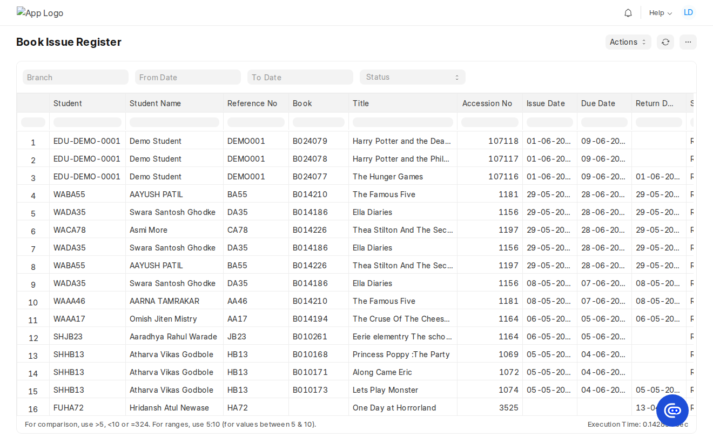

# Reports

The app ships **5 standard Script Reports** under the **Library Management** module — three for
**circulation** and two for **inventory**. Each section below has a plain-language summary (what it
answers, when to use it, available filters) followed by the technical details (source doctype,
columns, filters, and how it is built).

**Opening a report**

- Search bar: press `/`, type the report name.
- Direct URL: `/app/query-report/<Report Name>` (e.g. `/app/query-report/Overdue Books`).
- Report list: `/app/report?module=Library Management`.
- Export: report menu **(⋯) → Export** → CSV / Excel.

> Reports register in the database on `bench migrate` (or `bench --site <site> reload-doc
library_management report <folder>`). They live in
> [`report/`](../library_management/library_management/report/) as `<name>.py` (`execute`),
> `<name>.js` (filters), and `<name>.json` (definition).

---

## Circulation

### Book Issue Register

**What it answers:** the full log of every copy issued or returned — who, which book, and the dates.
**When to use:** auditing activity, finding a student's or a book's transaction history.
**Filters:** Branch, From Date, To Date (on issue date), Status (READING/RETURNED).

| Technical |                                                                                                                                          |
| --------- | ---------------------------------------------------------------------------------------------------------------------------------------- |
| Source    | `Library Transaction Book` ⨝ `Library Transactions` ⨝ `Student`                                                                          |
| Columns   | Student, Student Name, Reference No, Book, Title, Accession No, Issue Date, Due Date, Return Date, Status, **Reissued**, Branch          |
| Files     | [`book_issue_register.py`](../library_management/library_management/report/book_issue_register/book_issue_register.py) · `.js` · `.json` |

### Overdue Books

**What it answers:** which issued books are past their due date and by how many days.
**When to use:** chasing returns, daily overdue follow-ups.
**Filters:** Branch, As On Date (defaults to today).

| Technical |                                                                                                                             |
| --------- | --------------------------------------------------------------------------------------------------------------------------- |
| Source    | READING rows where `due_date < as_on_date`                                                                                  |
| Columns   | Student, Student Name, Reference No, Book, Title, Accession No, Issue Date, Due Date, **Overdue Days** (`DATEDIFF`), Branch |
| Files     | [`overdue_books.py`](../library_management/library_management/report/overdue_books/overdue_books.py) · `.js` · `.json`      |

### Most Issued Books

**What it answers:** the most popular titles, by number of times issued.
**When to use:** acquisition planning, identifying high-demand books.
**Filters:** Branch, From Date, To Date.

| Technical |                                                                                                                                    |
| --------- | ---------------------------------------------------------------------------------------------------------------------------------- |
| Source    | `Library Transaction Book` grouped by book                                                                                         |
| Columns   | Book, Title, Author, Accession No, **Total Issues**, **Currently Issued**                                                          |
| Files     | [`most_issued_books.py`](../library_management/library_management/report/most_issued_books/most_issued_books.py) · `.js` · `.json` |

---

## Inventory

### Library Stock Summary

**What it answers:** how many copies of each book exist, are available, and are out on loan, by
location.
**When to use:** stock-taking, finding shelves with low availability.
**Filters:** Branch, Room, Shelf, Only Out of Stock (checkbox).

| Technical |                                                                                                                                                |
| --------- | ---------------------------------------------------------------------------------------------------------------------------------------------- |
| Source    | `Library Books`                                                                                                                                |
| Columns   | Book, Title, ISBN, Accession No, Branch, Room, Shelf, Quantity, Available, **Issued** (`quantity - available`), Status                         |
| Files     | [`library_stock_summary.py`](../library_management/library_management/report/library_stock_summary/library_stock_summary.py) · `.js` · `.json` |

### Unavailable Books

**What it answers:** books with no copies available, or marked Inactive/Discontinued, with the
reason.
**When to use:** finding lost/withdrawn stock and books needing attention.
**Filters:** Branch, Status.

| Technical |                                                                                                                                    |
| --------- | ---------------------------------------------------------------------------------------------------------------------------------- |
| Source    | `Library Books` where `available_quantity <= 0` **or** `status IN (Inactive, Discontinued)`                                        |
| Columns   | Book, Title, ISBN, Accession No, Branch, Shelf, Available, Status, **Reason**                                                      |
| Files     | [`unavailable_books.py`](../library_management/library_management/report/unavailable_books/unavailable_books.py) · `.js` · `.json` |

---

## Quick links from the desk

Both the **Library Counter** and **Add Library Books** pages have a **Reports** button that opens a
dialog linking all five reports — see [user-guide.md](user-guide.md).

## Roles

Each report grants access to **System Manager** and **Librarian**. Adjust the `roles` array in the
report `.json` if you need additional roles.
