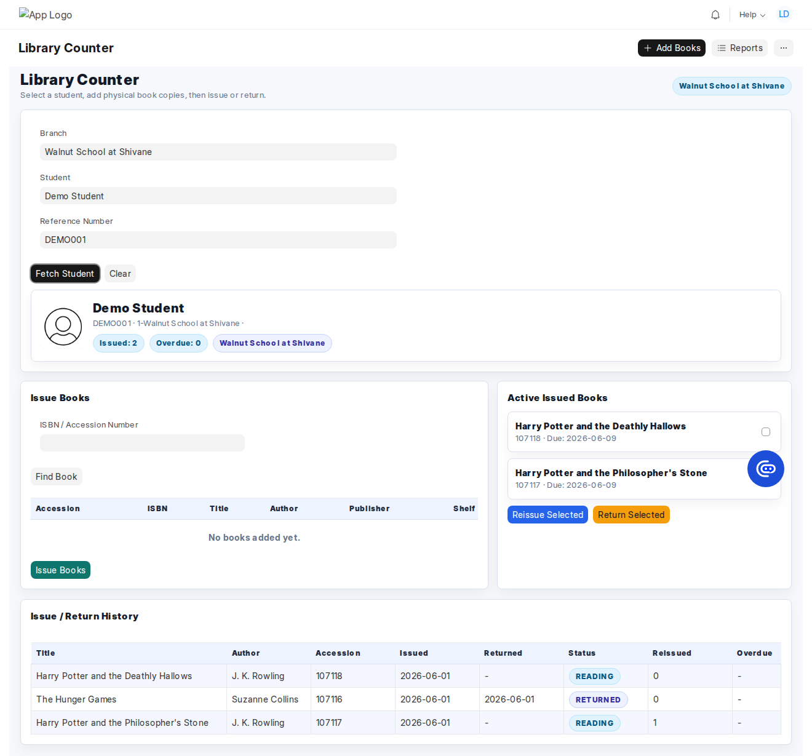
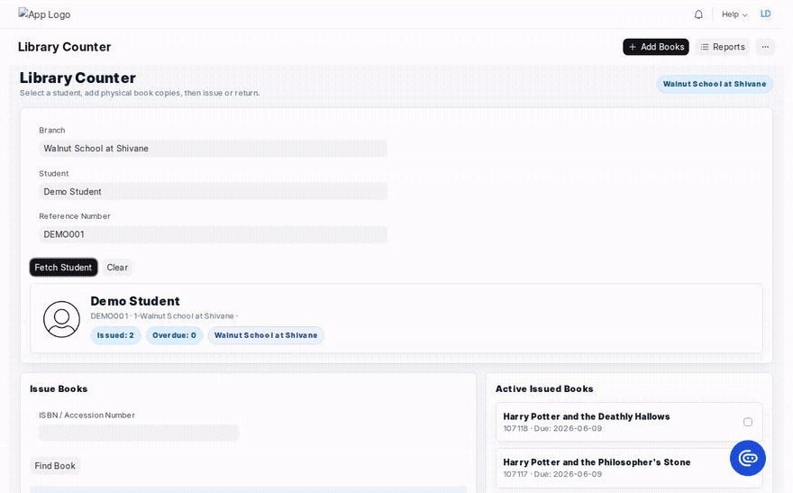
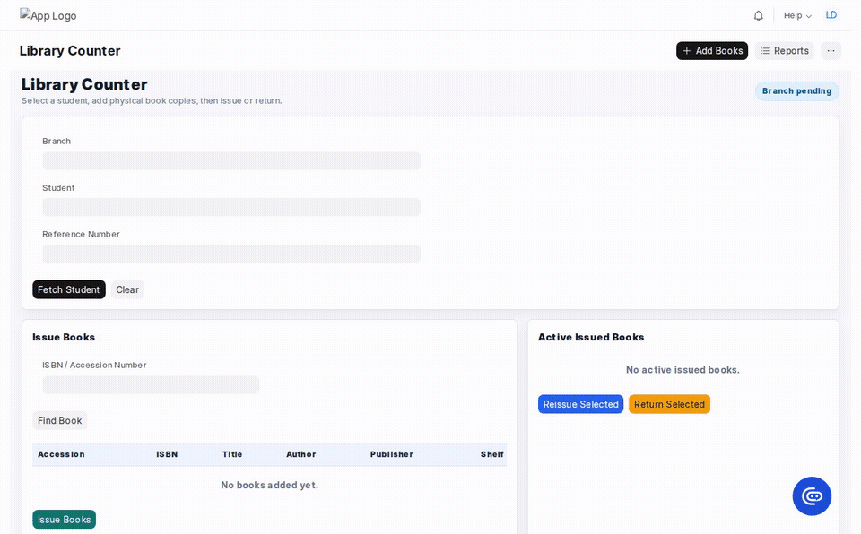
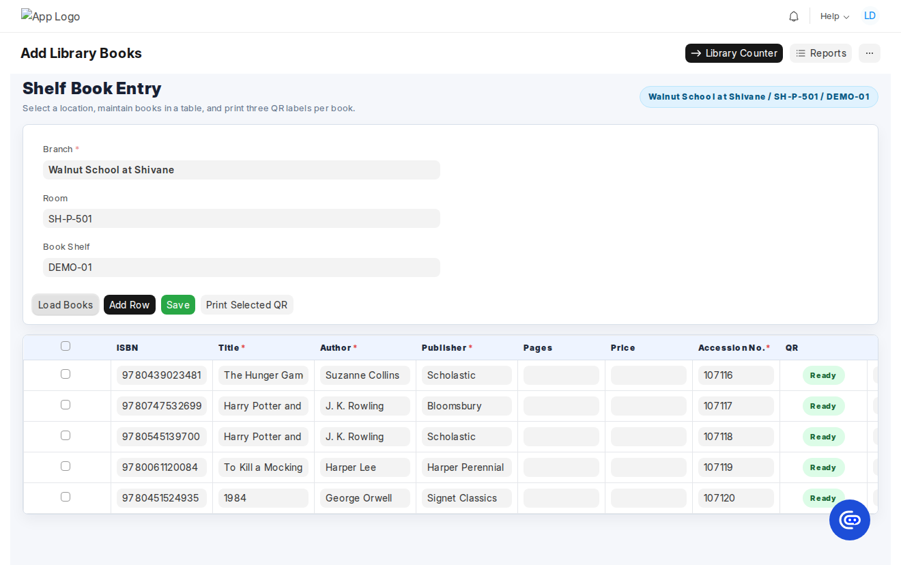
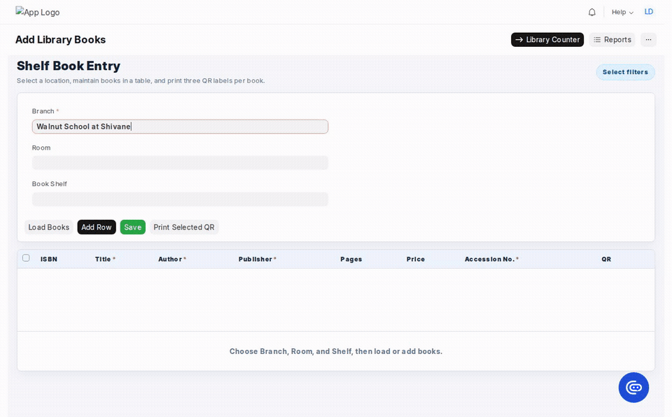
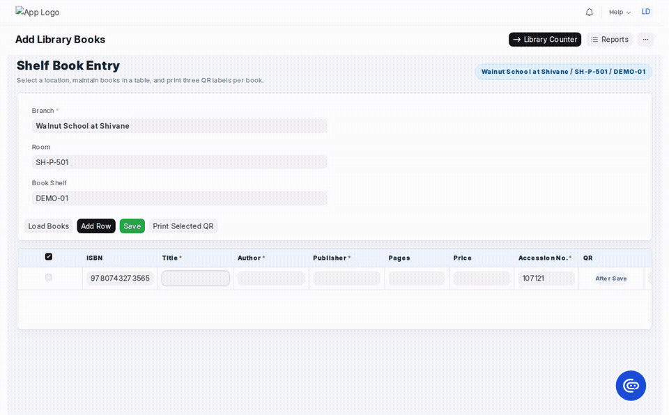
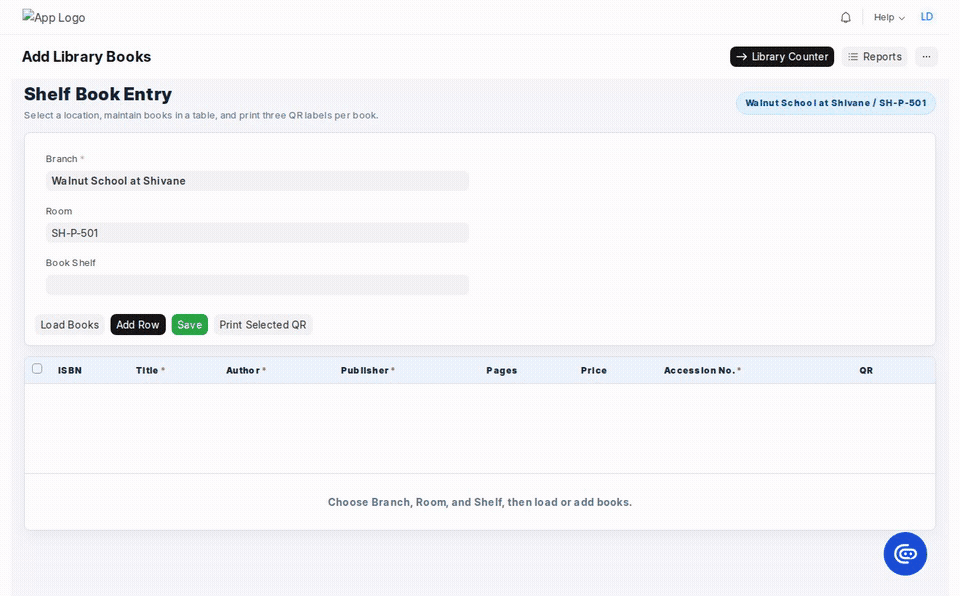
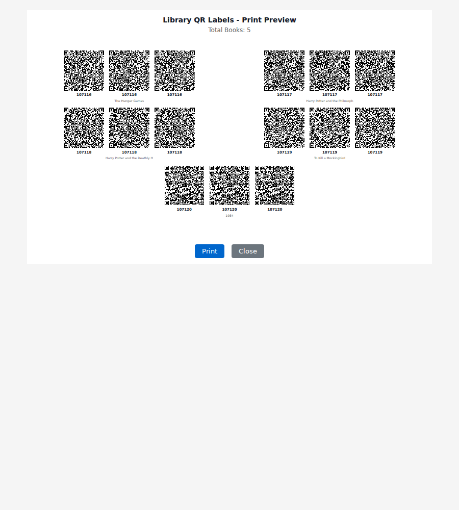
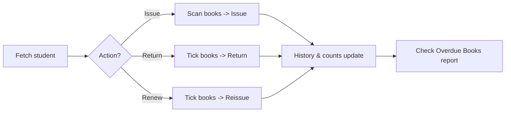

# User Guide

A plain-language guide for **librarians and school administrators**. No coding needed. It explains
the day-to-day screens — the **Library Counter** and **Add Library Books** — plus reports and
settings.

- [Key concepts](#key-concepts)
- [Library Counter (issue, return, reissue)](#library-counter)
- [Add Library Books (intake & QR labels)](#add-library-books)
- [Reports](#reports)
- [Settings (for admins)](#settings-for-admins)
- [Daily routine](#daily-routine)

---

## Key concepts

| Term                 | Meaning                                                                  |
| -------------------- | ------------------------------------------------------------------------ |
| **Book**             | A catalogued title in the library (e.g. _Ella Diaries_).                 |
| **Accession Number** | The unique number written/stuck on a physical copy.                      |
| **ISBN**             | The barcode number printed on the book; used to auto-fetch title/author. |
| **Issue**            | Give a book to a student.                                                |
| **Return**           | Take a book back.                                                        |
| **Reissue (Renew)**  | Extend a borrowed book's due date without returning it.                  |
| **Loan Period**      | How many days a book may be kept (set in Settings, default 30).          |
| **Branch**           | The school/campus a book belongs to.                                     |
| **Take-home**        | Whether a book is allowed to leave the library.                          |

---

## Library Counter

The circulation desk. Open it from the search bar (type "Library Counter") or at
`/app/library-counter`.

### 1. Find the student

- Pick a **Branch** if needed, then choose the **Student** or type their **Reference Number** and
  press Enter (or click **Fetch Student**).
- The **student card** shows their photo, program, **Issued** count, and **Overdue** count (the
  overdue chip turns amber when there are overdue books).

### 2. Issue books

1. In **Issue Books**, scan or type the **ISBN / Accession Number** and press Enter (or **Find
   Book**).
2. If there's a single exact match it's added automatically; otherwise pick the right copy from the
   list.
3. Repeat for each book, then click **Issue Books**. The books move to **Active Issued Books** and
   the student's counts update.

> A book can only be issued if it is **Active**, marked **take-home**, has an available copy, and
> belongs to the counter's branch (cross-branch needs a privileged role).

### 3. Return or reissue

In **Active Issued Books**, tick the books you want, then:

- **Return Selected** — marks them returned (today) and frees the copy.
- **Reissue Selected** — extends the due date to **today + loan period**, keeping the book issued.
  The reissue count for that book goes up by one.

| Issue                                         | Reissue                                           | Return                                          |
| --------------------------------------------- | ------------------------------------------------- | ----------------------------------------------- |
|  |  |  |

### 4. Issue / Return History

Below the issue/return panels, the **Issue / Return History** table lists everything the student has
ever borrowed — title, author, accession, issued/returned dates, status, **Reissued** count, and any
**Overdue** days. It refreshes after every issue, return, or reissue.

### Shortcuts

- **Add Books** button → jumps to the Add Library Books page.
- **Reports** button → opens a dialog linking all reports.

---

## Add Library Books

Bulk intake and maintenance of books. Open it via "Add Library Books" in the search bar, the **Add
Books** shortcut on the counter, or **Bulk Add Books** from the Library Books list.

1. Choose **Branch** (required), and optionally **Room** and **Book Shelf**.
2. **Load Books** to edit existing books at that location, or **Add Row** for new ones.
3. Type the **ISBN** and click away — the **Title, Author, Publisher and Pages** auto-fill when the
   book is found online.

   

4. Complete the required fields — **Title, Author, Publisher and Accession No.** are mandatory
   (marked with a red \*). Save is blocked until every row has them.
5. Click **Save**. Each saved book gets a QR code (the **QR** column shows **Ready**).
6. Tick books and click **Print Selected QR** to print labels — **three QR labels per book** — in a
   new window.

   

   The print window shows a ready-to-print sheet (3 QR codes per book, with accession number and
   title):

   

> The table has a sticky header and a horizontal scrollbar so you can move across the wide grid
> without losing the column titles.

---

## Reports

Five ready-made reports cover circulation and inventory. Open them from the **Reports** button on
either page, or from the search bar. Full details in [reports.md](reports.md).

| Report                    | Answers                                    |
| ------------------------- | ------------------------------------------ |
| **Book Issue Register**   | Every issue/return with dates and status   |
| **Overdue Books**         | What's past due and by how many days       |
| **Most Issued Books**     | The most popular titles                    |
| **Library Stock Summary** | Copies total / available / issued per book |
| **Unavailable Books**     | Books with no copies or marked inactive    |

Each report has filters (branch, dates, status) at the top, and can be exported to CSV/Excel via the
menu **(⋯) → Export**.

---

## Settings (for admins)

Open **Library Management Settings** (search "Library Management Settings"). Fields:

| Setting                             | What it does                                                        |
| ----------------------------------- | ------------------------------------------------------------------- |
| **Loan Period**                     | Days a book may be kept; drives due dates and reissue (default 30). |
| **Enable External Metadata Lookup** | Auto-fetch book details from the internet by ISBN.                  |
| **Enable AI Fallback**              | If basic lookup fails, use AI to read the cover (needs an API key). |
| **OpenAI API Key** / **AI Model**   | Credentials/model for the AI fallback.                              |
| **Default Take Home**               | Whether new books are borrowable by default.                        |
| **Branch Override Role**            | The role allowed to issue books across branches.                    |

---

## Daily routine

For new stock, use **Add Library Books** → fill details → **Save** → **Print Selected QR**, then
shelve the labelled copies.
